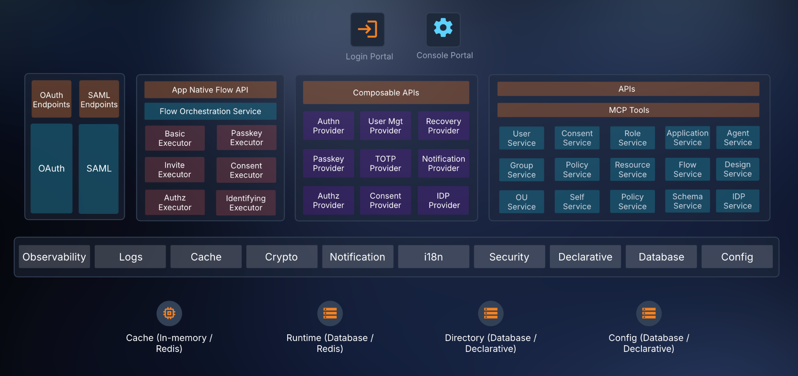

# **Project Name**

**ThunderID**

# **Preferred Maturity Level**

**Growth**

# **Project Description**

ThunderID is an open-source, modern Identity and Access Management stack designed to secure humans, AI agents, and machines across traditional and decentralized identity ecosystems. Built from the ground up in Go, it is designed to deliver high performance, low latency, and a lightweight runtime footprint. It is designed with a developer-first mindset, prioritizing flexibility and ease of integration.

Core design goals of ThunderID includes:

**Agent-native identity:** ThunderID is designed for the agent era by managing AI agents as first-class identities and supporting identity lifecycle and controls for agent-driven use cases. This includes delegated authority, consent-aware access, traceability, and the ability to issue verifiable credentials for agents. ThunderID also aims to expose identity capabilities in a way that agents can use natively, enabling agent-driven applications and workflows to interact with IAM services safely and programmatically.

**Decentralized identity:** A key goal of ThunderID is to bridge the adoption gap on the relying party side, making it practical for service providers to consume, verify, and trust decentralized identity in real-world applications. This includes interoperability with DIDs, verifiable credentials, digital wallets, trust registries, and issuer-verifier-holder interaction models.

**Cloud-native IAM:** ThunderID is designed as a lightweight, containerized identity product that can be deployed across on-premises and cloud environments. It provides a declarative approach to defining identity flows, policies, and configurations, enabling IAM capabilities to be automated, versioned, and managed through GitOps practices.

**Post-quantum-safe security:** ThunderID is designed for post-quantum readiness, supported by a crypto-agile foundation where algorithms, key types, signing methods, and token protection mechanisms can evolve over time. This includes support for post-quantum-safe algorithms and hybrid transition approaches across key management, credential issuance, assertions, and secure service-to-service communication.

Core capabilities today include:

* Manage identities for users, AI agents, and workloads, along with their attributes and credentials.  
* Organize management of identity resources through a hierarchical organizational unit model.  
* Standard based authentication and authorization based on OAuth 2.1 and OpenID Connect specifications  
* A flow engine for orchestrating login, registration, account recovery, and step-up authentication flows with a wide variety of tools to be used in the flows to build the needed experience  
* Fine grained authorization and Policy based consent management  
* White labeling & localizing end user facing interfaces  
* Developer tools including Console UI, SDKs, APIs & MCP

On the near-term roadmap, ThunderID includes first-class support for decentralized identity use cases through verifiable credential flows, including the OpenID for Verifiable Credentials family of specifications including OID4VCI for credential issuance and OID4VP for credential presentation. This enables ThunderID to act as a credential issuer, verifier, and relying party within verifiable credential ecosystems, including OWF-aligned wallets and broader decentralized trust infrastructures.

**Early adoption:** ThunderID is already being integrated into production and open-source initiatives as a core identity component, including [MOSIP](https://www.mosip.io/) - [eSignet](https://www.mosip.io/eSignet), [OpenChoreo](https://www.cncf.io/projects/openchoreo/), and [Lanka Software Foundation](https://github.com/LSFLK) projects.

ThunderID was initiated in 2025 May at [WSO2](https://wso2.com/) as a ground-up, rethink of WSO2's 15+ years of work on the IAM domain, developed in the open at[https://github.com/thunder-id/thunderid](https://github.com/thunder-id/thunderid) with contributions from WSO2 and from the [MOSIP](https://www.mosip.io/) team. WSO2 is now contributing the entire repository to the OpenWallet Foundation for neutral governance.

**About WSO2:**

WSO2 has been a 100% open-source company since its founding in 2005, with every product available under the Apache License 2.0 from day one. The company has a strong track record of contributing to open-source foundations - most recently donating [OpenChoreo](https://www.cncf.io/projects/openchoreo/) to the CNCF as a Sandbox project in January 2026.

# **Alignment with the OpenWallet Foundation Mission**

OWF’s current portfolio includes wallet runtimes, credential libraries, and interoperability initiatives. ThunderID complements this ecosystem by contributing a trust layer by extending a standards-based IAM platform into an OWF-aligned issuer and verifier service that wallet projects and applications can integrate with.

ThunderID's alignment with OWF includes:

**Verifiable credential issuance services** - Extending ThunderID's identity provider capabilities to issue verifiable credentials to digital wallets using OpenID for Verifiable Credential Issuance (OID4VCI). This enables enterprises and public-sectors to adopt wallet-based credential issuance without needing deep expertise in underlying credential specifications.

**Wallet-based presentation** - Adding OpenID for Verifiable Presentations (OpenID4VP) support so that applications integrated with ThunderID can accept verifiable presentations from compatible digital wallets for authentication, user onboarding, identity verification, and other trust decisions.

**Reusable infrastructure for OWF wallet projects** - Providing a reusable, standards-based issuer and verifier backend that OWF wallet projects can integrate with through open protocols, giving wallet developers a ready-made trust services layer for credential issuance, verification, and presentation flows.

**Enterprise adoption path into decentralized identity** - Bringing established OAuth 2.0, OpenID Connect, and enterprise federation patterns into the wallet ecosystem, allowing organizations to transition incrementally from centralized IAM deployments toward verifiable credential-based trust models.

Contributing ThunderID adds the enterprise identity and trust services layer to OWF's ecosystem, complementing its existing wallet and credential infrastructure with production-grade issuance, verification, and relying-party capabilities.

# **Code of Conduct**

None currently adopted. ThunderID will adopt the OpenWallet Foundation Code of Conduct.

# **TAC Sponsor**

*TBD*  to be identified before the vote.

# **Project License**

[Apache License, Version 2.0](https://github.com/thunder-id/thunderid/blob/main/LICENSE)

# **Source Control**

https://github.com/thunder-id/thunderid

# **Issue Tracker**

https://github.com/thunder-id/thunderid/issues

# **External Dependencies**

Go-based project. All runtime and build dependencies are under OSI-approved permissive licenses (Apache 2.0, BSD, MIT). No copyleft (GPL/LGPL/AGPL) runtime dependencies. 

ThunderID supports the following specifications

* OAuth 2.0 Core (RFC 6749)  
* OAuth 2.0 Bearer Token Usage (RFC 6750)  
* Proof Key for Code Exchange by OAuth Public Clients - PKCE (RFC 7636)  
* OAuth 2.0 Token Introspection (RFC 7662)  
* OAuth 2.0 Authorization Server Metadata (RFC 8414)  
* OAuth 2.0 Token Exchange (RFC 8693)  
* OAuth 2.0 Resource Indicators (RFC 8707)  
* Pushed Authorization Requests (RFC 9126)  
* Dynamic Client Registration (RFC 7591)  
* JSON Web Token - JWT (RFC 7519)  
* JWT Profile for Access Tokens (RFC 9068)  
* JSON Web Signature (RFC 7515)  
* JSON Web Encryption (RFC 7516)  
* JSON Web Key Set (RFC 7517)

# **Release Methodology**

Semantic-versioned releases published on GitHub with release notes and a multi-arch Docker image per release. Current cadence is milestone-driven (pre-1.0); moving to a time-boxed cadence is part of the Growth-stage plan.

# **Initial Maintainers**

[Maintainers](https://github.com/thunder-id/thunderid/blob/main/MAINTAINERS.md)

# **Proposed Project Governance**

Lightweight and consensus-driven to start, evolving toward a maintainer-council / technical-steering model as the community grows:

# **Financial Sponsorship**

No direct cash sponsorship. Development is funded through in-kind engineering contributions from **WSO2** (initiator, committed to continuing post-contribution) and the **MOSIP eSignet team** (ongoing code and review contributions).

# **Infrastructure**

Requesting the standard [OWF services for projects](https://tac.openwallet.foundation/governance/project-and-lab-services/):

* Dedicated GitHub organization `thunder-id` (already confirmed by OWF staff).  
* CI/CD via GitHub Actions / LF runners.  
* Container registry / release artifact hosting.  
* Mailing list (e.g., `thunderid@lists.openwallet.foundation`) and an OWF Discord channel.  
* Project website / docs hosting under the OWF umbrella.  
* Community meeting infrastructure (calendar, video, recordings).

As part of the Contribution Agreement, the **ThunderID logo and brand marks**, associated **domain(s)**, and **social media accounts** will transfer from WSO2 to the OpenWallet Foundation.

# **Architecture Diagram**

